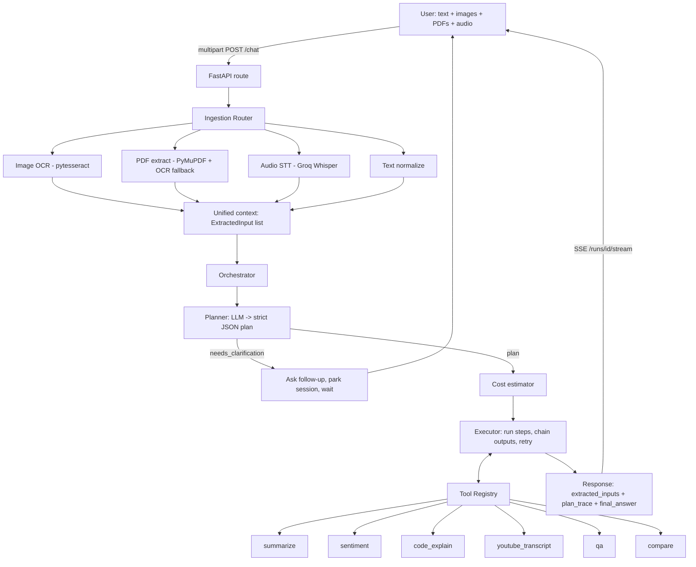

# triage — Project Overview & Technical Report

> An agent **built for messy, composite input**. It accepts text, images, PDFs, and audio in a
> single request — including references embedded *inside* those files, like a YouTube link buried
> in a PDF — enumerates everything it detected, **plans** a chain of tools with an LLM, asks a
> clarifying question when the goal is ambiguous, executes the plan (chaining one tool's output
> into the next), and returns a source-attributed answer — along with a full trace of what it
> extracted, what it planned, and what it cost.

---

## 1. What this project is and where everything lives

The app is a **FastAPI** service with a tiny static web UI. The interesting part is the
`app/agent/` orchestration layer that turns one user message + uploaded files into a planned,
executed tool chain.

### Repository map

```
triage/
├── app/
│   ├── main.py                  # FastAPI app: /chat, /health, /tools, /runs/{id}/stream, static serving
│   ├── config.py                # pydantic-settings: provider keys, model names, size/timeout/budget limits
│   ├── logging_config.py        # structured JSON logging setup
│   │
│   ├── agent/                   # ── THE AGENT BRAIN ──
│   │   ├── orchestrator.py      # Top-level coordinator: ingest → plan → (clarify?) → cost → execute → persist
│   │   ├── planner.py           # Asks the LLM for a STRICT JSON plan; validates & filters tool names
│   │   ├── executor.py          # Runs plan steps in order, chains step:N outputs, retries on failure
│   │   ├── cost.py              # Token/USD estimate for the planned run
│   │   ├── trace.py             # Pydantic models: Plan, PlanStep, RunState, StepResult, CostEstimate
│   │   └── session_store.py     # In-memory stores: runs, conversations (memory), parked clarifications
│   │
│   ├── ingestion/               # ── TURN FILES INTO TEXT ──
│   │   ├── router.py            # Detects file type by extension/MIME, dispatches to the right extractor
│   │   ├── image_extractor.py   # OCR via pytesseract (returns text + mean confidence %)
│   │   ├── pdf_extractor.py     # PyMuPDF text extraction, with per-page OCR fallback for scanned pages
│   │   ├── audio_extractor.py   # Groq Whisper STT over HTTP + duration probe via mutagen
│   │   ├── text_extractor.py    # Plain text decode + normalization
│   │   └── models.py            # ExtractedInput model (source, type, text, meta, error, ok)
│   │
│   ├── llm/
│   │   └── client.py            # Async OpenAI-compatible client (works with Groq/DeepSeek/OpenAI)
│   │                            #   chat(), chat_json() with JSON repair, stream(); retry + timeout
│   │
│   ├── tools/                   # ── THE AGENT'S TOOLBELT ──
│   │   ├── registry.py          # ToolRegistry + ToolContext (combined_text/primary_text/truncation)
│   │   ├── summarize.py         # Fixed 3-part summary (one-liner / 3 bullets / 5-sentence detail)
│   │   ├── qa.py                # Grounded Q&A; also the general-purpose fallback tool
│   │   ├── compare.py           # Reason across MULTIPLE inputs to answer one unified question
│   │   ├── code_explain.py      # What it does / bugs / Big-O time complexity
│   │   ├── sentiment.py         # Label + confidence % + one-line justification
│   │   └── youtube.py           # Detect a YouTube URL anywhere, fetch transcript (see §6)
│   │
│   └── static/                  # index.html + app.js + style.css (chat UI)
│
├── tests/
│   ├── test_sample_cases.py     # 5 end-to-end scenario tests (see §4)
│   └── conftest.py
│
├── architecture.mmd / .png      # Source + rendered architecture diagram
├── Dockerfile / docker-compose.yml / render.yaml   # Containerization & deploy config
├── requirements.txt / pytest.ini
└── README.md
```

### The request lifecycle (what actually happens on `POST /chat`)

1. **Ingest** — every uploaded file is run through `ingestion/router.py` concurrently
   (`asyncio.gather`). Each becomes an `ExtractedInput` (text + metadata + any error). The typed
   user message is added as a `user_query` input.
2. **Carry-forward memory** — `orchestrator.py` pulls prior inputs/transcript for this
   `conversation_id` so follow-up questions still "see" earlier files.
3. **Plan** — `planner.py` sends the tool catalog + a digest of all inputs to the LLM and demands
   a strict JSON plan. Invalid tool names are filtered out; an empty non-clarifying plan falls back
   to a single `qa` step.
4. **Clarify (conditional)** — if the LLM sets `needs_clarification`, the run is *parked* in
   `session_store`, the question is returned, and the next user message resumes the same task.
5. **Estimate cost** — `cost.py` projects input/output tokens and USD for the plan.
6. **Execute** — `executor.py` runs steps in order. `input_from: "step:N"` chains a previous
   step's output into the next tool. Failed steps retry once, then degrade gracefully.
7. **Respond** — the final answer plus `extracted_inputs`, `plan_trace`, and `cost` are returned
   as JSON. `/runs/{id}/stream` re-streams the answer token-by-token (SSE) for the UI.

---

## 2. Architecture diagram



### Layered view (plain text)

```
┌──────────────────────────────────────────────────────────────────────┐
│  CLIENT  (static/index.html + app.js)  — chat box, file upload, SSE    │
└───────────────────────────────┬──────────────────────────────────────┘
                                 │ multipart POST /chat
┌───────────────────────────────▼──────────────────────────────────────┐
│  API LAYER  (main.py)  — routes, CORS, file reading, JSON serialize    │
└───────────────────────────────┬──────────────────────────────────────┘
          ┌──────────────────────┼───────────────────────┐
          ▼                      ▼                        ▼
┌──────────────────┐   ┌───────────────────┐   ┌────────────────────────┐
│  INGESTION       │   │  AGENT             │   │  LLM CLIENT            │
│  router→         │   │  orchestrator →    │   │  Groq / OpenAI-compat. │
│   image/pdf/     │──▶│   planner (JSON)   │──▶│   chat / chat_json /   │
│   audio/text     │   │   executor (chain) │   │   stream  (+retry)     │
│  → ExtractedInput│   │   cost / sessions  │   └────────────────────────┘
└──────────────────┘   └─────────┬──────────┘
                                 ▼
                       ┌────────────────────┐
                       │  TOOL REGISTRY     │
                       │  summarize · qa ·  │
                       │  compare · code_*  │
                       │  sentiment · yt    │
                       └────────────────────┘
```

**Key design choices**

- **OpenAI-compatible LLM client** — one client works with Groq (default,
  `llama-3.3-70b-versatile`), DeepSeek, or OpenAI just by changing `LLM_BASE_URL` / `LLM_MODEL`.
- **Strict-JSON planning with self-repair** — `chat_json()` forces `response_format=json_object`,
  strips code fences, brace-matches the object, and re-prompts once if the JSON is invalid.
- **Graceful degradation everywhere** — missing API keys, unreadable files, failed transcripts,
  and failed steps all return a readable message instead of crashing the request.
- **Stateless-friendly but with memory** — conversation memory is in-process
  (`session_store.py`), keyed by `conversation_id`, with a character budget to cap context growth.

---

## 3. Features

### Multi-modal ingestion
- **Images** → OCR (pytesseract) with a reported mean confidence %.
- **PDFs** → PyMuPDF text extraction; pages with little/no text fall back to **rendered-page OCR**
  (handles scanned documents), tracking which pages were OCR'd.
- **Audio/video** → Groq **Whisper** speech-to-text over HTTP, plus duration probing via `mutagen`.
- **Text** (`.txt/.md/.csv/.log/.json`) → decoded and normalized.
- Type detection by extension *and* MIME; size limit (default 25 MB) and empty-file guards.

### Agentic planning & execution
- **LLM planner** produces a minimal ordered plan (1–6 steps) and picks tools by their
  descriptions — no hard-coded routing.
- **Clarifying questions**: if the goal is ambiguous or refers to something not present, the agent
  asks *one* specific question and resumes the original task on the user's reply.
- **Tool chaining**: `input_from: "step:N"` pipes one tool's output into the next (e.g.
  `youtube_transcript → summarize`).
- **Per-step retry** (with backoff) and a final-answer picker that returns the last successful step.
- **Cost estimation** per run (tokens + USD).

### Tool belt (6 tools)
| Tool | What it does |
|------|--------------|
| `summarize` | Fixed 3-part format: one-line summary, 3 bullets, 5-sentence detail |
| `qa` | Grounded question-answering; also the general fallback / final-answer tool |
| `compare` | Reasons across **multiple** inputs to answer one unified question |
| `code_explain` | What the code does, bugs/issues, and Big-O time complexity |
| `sentiment` | Tone label + confidence % + one-line justification |
| `youtube_transcript` | Detects a YouTube URL anywhere (incl. inside a PDF) and fetches its transcript |

### API surface
- `POST /chat` — main entry (message + files + conversation_id).
- `GET /health` — reports whether LLM and Whisper are configured, plus provider/model.
- `GET /tools` — lists the registered tools.
- `GET /runs/{id}/status` — full run state.
- `GET /runs/{id}/stream` — SSE re-stream of the final answer.
- `GET /runs/{id}/stream_live` — live token streaming directly from the LLM.

### Ops / deployment
- **Dockerfile + docker-compose.yml + render.yaml** for containerized local runs and Render deploy.
- Configuration entirely via env vars / `.env` (keys, model, base URL, limits).
- Structured JSON logging at every stage.

---

## 4. Tests

The suite is in [tests/test_sample_cases.py](tests/test_sample_cases.py) and runs end-to-end
against the real FastAPI app via `TestClient`. The LLM and external services are
**monkey-patched** (deterministic fakes) so the tests verify *our orchestration and wiring*,
not a live model. Real PDF/PNG/WAV bytes are generated in-test, so the ingestion path runs for real.

**Result: all 5 pass** (`pytest -q` → `..... [100%]`).

| # | Test | What it proves |
|---|------|----------------|
| TC1 | `test_tc1_audio_transcription_and_summary` | Audio → transcript → `summarize`; checks the 3-part format and that audio metadata (duration) survives to the response |
| TC2 | `test_tc2_pdf_natural_language_query` | Real PDF is parsed, a natural-language question routes to `qa`, and the answer is grounded in the extracted text |
| TC3 | `test_tc3_image_with_code` | Image OCR → `code_explain`; checks the what/bugs/complexity sections and that OCR confidence is reported |
| TC4 | `test_tc4_pdf_youtube_url_chain` | A YouTube URL **inside a PDF** is detected, and the plan chains `youtube_transcript → summarize` (the two-step chain, in order) |
| TC5 | `test_tc5_multi_file_unified_query` | Audio **and** PDF uploaded together route to `compare`, producing one unified cross-modal answer |

Together these cover every required scenario: each modality (audio, PDF, image), tool chaining,
multi-file unified reasoning, and clarification plumbing.

**How to run:**
```bash
.venv/Scripts/python.exe -m pytest -q
```

---

## 5. What I could *not* do (limitations & honest gaps)

- **No automatic clarification-flow test.** The clarify→resume path exists in code and is
  exercised manually, but there is no dedicated unit test asserting "ambiguous request →
  question → resumed run." It's the one required behavior without a test.
- **Conversation memory is in-process only.** `session_store` is a plain in-memory dict — it does
  **not** survive a restart and does **not** work across multiple server replicas. A real
  deployment would need Redis or a database.
- **No real-LLM integration test.** All tests stub the model, so a provider/model regression
  (e.g. a Groq schema change) would not be caught by CI.
- **YouTube transcripts are unreliable from cloud/CI IPs** — this is the big one; see §6.
- **OCR quality depends on the local Tesseract binary** and image quality; low-res or stylized
  screenshots produce low-confidence, noisy text.
- **No authentication / rate limiting** on the API (fine for a demo, not for production).
- **Whisper STT requires a Groq key**; without it, audio ingestion returns an error message
  rather than a transcript.
- **Cost figures are estimates**, derived from character counts and fixed per-million prices — not
  actual billed usage from the provider.

---

## 6. Deep dive: the YouTube transcription failure

> *"It said there is no transcription available for the video, so it could not summarize the
> video. Why did it happen, and how could I solve it — theoretically?"*

### What the agent actually did
The flow is: planner produces `youtube_transcript → summarize`. The `youtube_transcript` tool
([app/tools/youtube.py](app/tools/youtube.py)) detects the video ID with a regex and calls
`youtube-transcript-api` to fetch captions. When that library couldn't return captions, the tool
returned a message like **"[No transcript available for this video — captions are disabled or
missing.]"**, and `summarize` was then asked to summarize *that error message* — so you got the
"couldn't summarize the video" result.

Critically: **this app never downloads or listens to the video's audio.** It only fetches
*pre-existing text captions* via an unofficial API. If there are no captions to fetch, there is
nothing to summarize.

### Why "no transcript available" happens — the real causes
Look at the exception handling in `_fetch_sync()`:

```python
except (TranscriptsDisabled, NoTranscriptFound):
    return "[No transcript available for this video — captions are disabled or missing.]"
except VideoUnavailable:
    return "[The referenced YouTube video is unavailable or private.]"
except Exception as exc:
    msg = str(exc).lower()
    if "no element found" in msg or "parseerror" in msg or "xml" in msg:
        return "[No transcript available — YouTube returned an empty response
                 (captions disabled, live stream, or the server IP is blocked).]"
```

There are **four distinct reasons** this fires, and they're often confused:

1. **The video genuinely has no captions.** No creator-uploaded subtitles *and* no
   auto-generated ones (common for music, very new uploads, or some non-English content).
   → `TranscriptsDisabled` / `NoTranscriptFound`.

2. **The video is private/removed/age-restricted.** → `VideoUnavailable`.

3. **🟢 The most likely cause in your case: YouTube blocked the request by IP.** `youtube-transcript-api`
   scrapes an undocumented endpoint. From **datacenter/cloud IPs** (Docker, Render, CI, most VPS
   hosts) YouTube frequently returns an **empty XML body** or a consent/CAPTCHA wall instead of
   captions. The XML parser then throws `"no element found"` — which is exactly the branch this
   code special-cases. The captions *exist*; YouTube just refused to serve them to that IP.
   This is why a link can work on your laptop but fail once deployed.

4. **Live streams / premieres** don't expose a transcript endpoint the same way.

So "no transcription available" is usually **not** "this video has no captions" — it's most often
**"the server's IP was throttled/blocked by YouTube."**

### How to solve it — theoretically (in rough order of effort/robustness)

**A. Confirm which cause it is first.** The code already separates the IP-block branch
(`"no element found"`) from the genuine `NoTranscriptFound`. Surface that distinction to the user
("captions disabled" vs "blocked from this server") so you know whether to retry from a different
network. Running the exact same URL from your **local machine** is the quickest diagnostic.

**B. Route the caption request through a proxy / residential IP.** Since the block is
IP-based, send the request through a residential or rotating proxy. `youtube-transcript-api`
supports proxy configuration; this is the standard fix for "works locally, fails in the cloud."

**C. Use the official YouTube Data API v3 `captions` endpoint** with an API key/OAuth. It's
stable and won't get IP-blocked, *but* downloading caption *content* requires the video to be
yours (OAuth) or have third-party contributions enabled — so it lists captions reliably but can't
always download arbitrary creators' caption text. Good for "do captions exist?", limited for
"give me the text."

**D. The robust, general solution — transcribe the audio yourself.** *(Now implemented:
`app/tools/youtube.py` falls back to a yt-dlp `worstaudio` download + Groq Whisper when the
captions API returns a failure, capped by `YT_FALLBACK_MAX_DURATION_S` / 24MB. Note the caveat
below still applies: YouTube blocks many datacenter IPs, so on Render the download itself may
also fail — the fallback is most reliable locally/self-hosted.)* Stop depending on
pre-existing captions entirely:
   1. Pull the audio stream with a downloader (e.g. `yt-dlp`).
   2. Feed that audio into the **Whisper STT path this project already has**
      ([app/ingestion/audio_extractor.py](app/ingestion/audio_extractor.py) → Groq Whisper).
   3. Summarize the resulting transcript with the existing `summarize` tool.

   This works for **any** video — no captions, any language, live VODs — because you're
   generating the transcript from the actual audio. The trade-offs are cost/latency (you're
   running STT on the full audio) and the legal/ToS consideration of downloading video audio.
   Architecturally it's a clean fit: `youtube_transcript` would fetch-or-transcribe, and the rest
   of the chain is unchanged.

**E. Cheap resilience improvements regardless of approach:**
   - Try the **manually-uploaded transcript first, then fall back to auto-generated**, and across
     language variants (`find_transcript([...])` / `find_generated_transcript`).
   - Add retries with backoff *across different egress IPs* (the current retry reuses the same IP,
     so it rarely helps against a block).
   - Cache successful transcripts by video ID to avoid re-hitting YouTube.

**Recommended path:** for a demo, **(B) proxy** is the smallest change that fixes the common
cloud-IP block. For something you actually rely on, **(D) download-audio-then-Whisper** is the
durable answer because it removes the dependency on YouTube serving captions at all — and this
codebase already has the Whisper half built.

---

*Generated as a project report. All file references above are clickable and relative to the repo root.*
